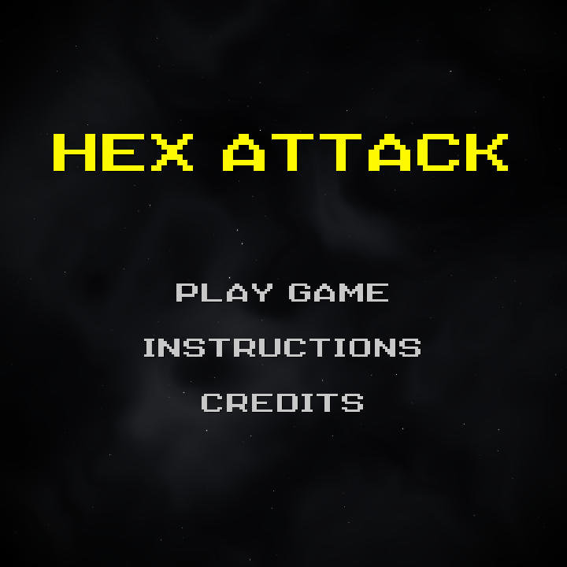
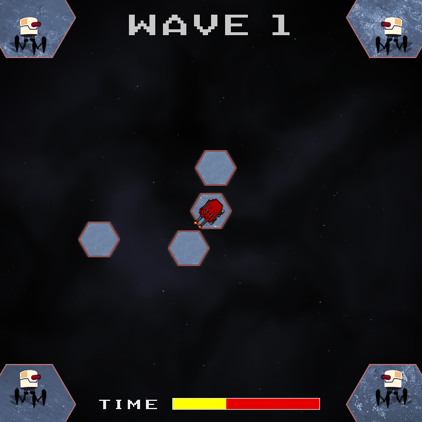
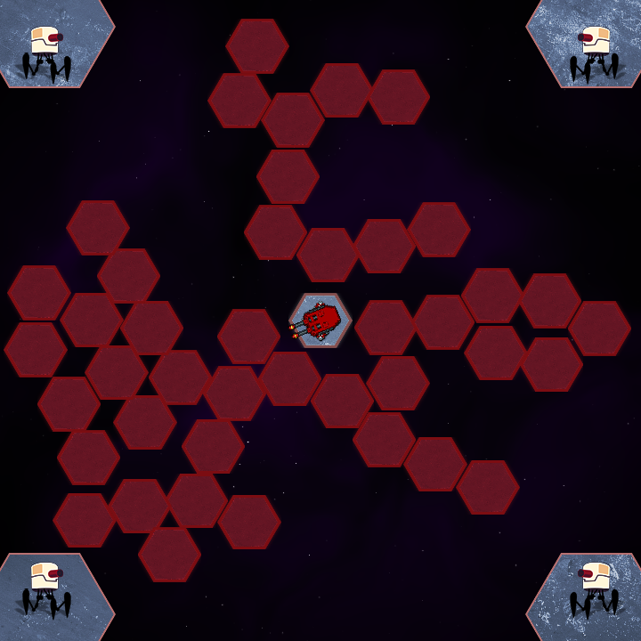

## HEX ATTACK - Avoid Enemies and Survive!

### Description

HEX ATTACK is a action survival game developed in C++ using the Raylib framework. In this game, you control a central cannon and must defend your base against relentless waves of flying hexagons. Your primary objective is to destroy these hexagons before they connect to the central platform and build a bridge allowing the enemies in the screen's corners to invade.

Can you survive every wave as the speed and difficulty increase?

### Features

- Action-packed gameplay: fast and responsive shooting mechanics.
- Wave progression system: difficulty scales up as the hexagon spawn intervals decrease and speed increases with each wave.
- Cross-platform: compiled for Desktop (OpenGL 3.3) and Web/HTML5 (WebGL 1.0 / GLSL 100).
- Custom visuals: procedural space nebula and starfield background generated using GLSL shaders.
- Polished feedback: screen effects, sprite animations for explosions, and dynamic UI elements.

### Controls

**Mouse**
 
- Move mouse: aim the cannon.
- Left mouse button: shoot.

**Keyboard**

- Left and right arrow keys: rotate the cannon.
- Spacebar: shoot.
- Enter: play again (on Game Over screen).

### Screenshots

**Frenetic action in every direction!** Spin, aim, and shoot. Survive relentless waves of enemies that get faster every second. Your reflexes are your only defense.

**Imminent threat: Don't let the bridge form!**

Each hexagon that escapes your shots attaches to the central platform. If they manage to build a bridge to the corners of the screen, the invasion begins and it's *Game Over*! Keep the arena clear at all costs.

### Developers

 - Paulo Giovani - Programming, game design and some arts.

### Resources

Assets from Itch.io, Pixabay, and DaFont:

- Zintoki: [Ground Shaker] (https://zintoki.itch.io/ground-shaker)
- QwerryAnimation: [Robot D-8080 Enemy] (https://qwerryanimation.itch.io/robot-d-8080)
- Ansimuz: [Explosion Animations Pack] (https://ansimuz.itch.io/explosion-animations-pack)
- Biww: [Small Explosion Blast Impact] (https://pixabay.com/pt/sound-effects/filme-e-efeitos-especiais-small-explosion-blast-impact-561896)
- Seventhpaw: [Game Over Halo] (https://www.myinstants.com/pt/instant/game-over-halo)
- Ribhav Agrawal: [Metal Beaten SFX] (https://pixabay.com/sound-effects/film-special-effects-metal-beaten-sfx-230501)
- Game Font: [Nineteen Ninety Seven] (https://www.dafont.com/nineteen-ninety-seven.font)

### Links

 - itch.io Release: https://paulo-giovani.itch.io/hex-attack

### License

This project sources are licensed under an unmodified zlib/libpng license, which is an OSI-certified, BSD-like license that allows static linking with closed source software. Check [LICENSE](LICENSE) for further details.

*Copyright (c) 2026 @paulogiovani*